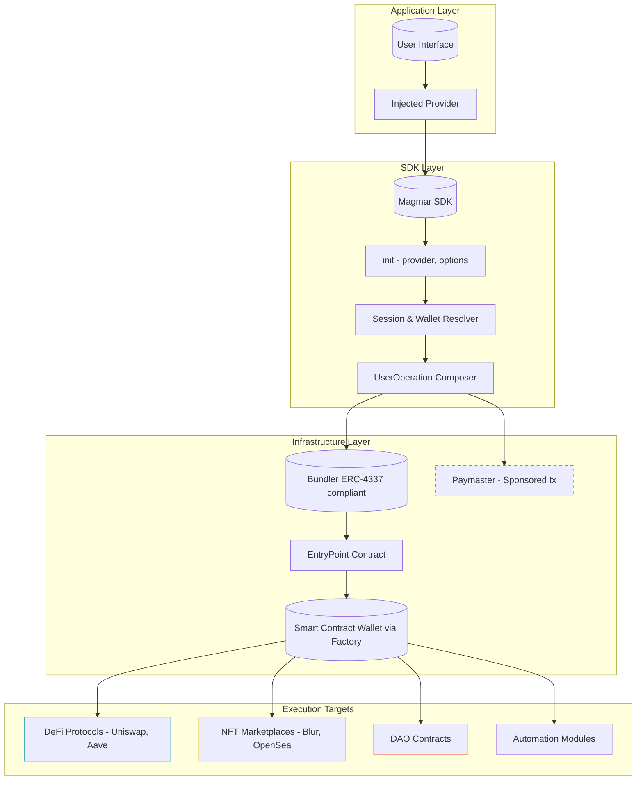
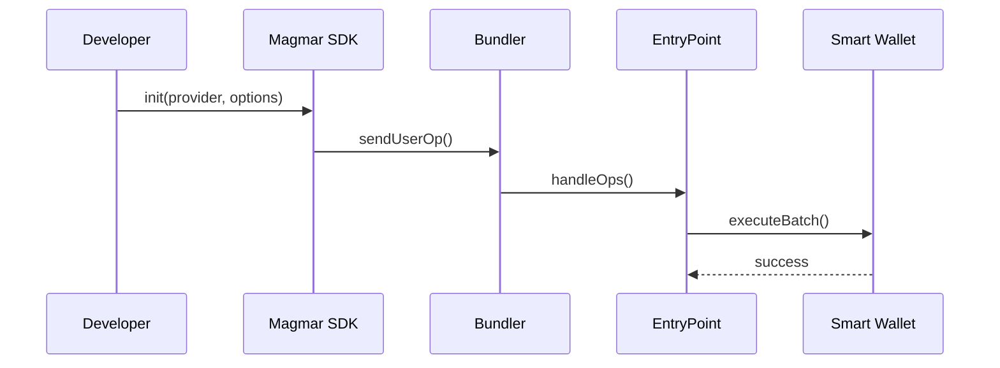
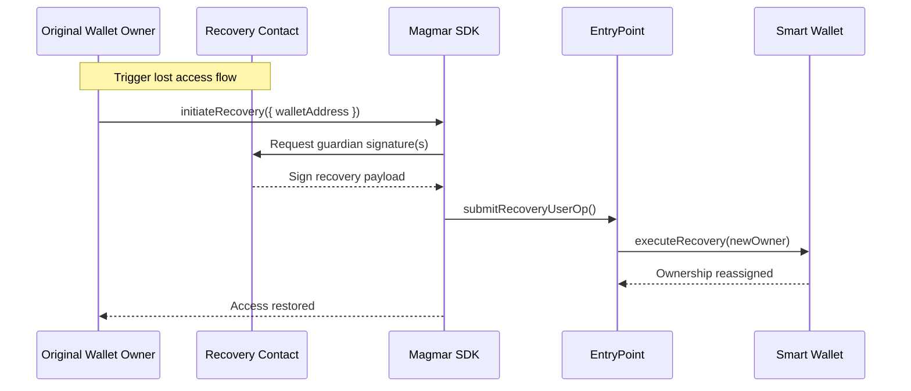

# Magmar SDK Example — Programmable Wallets in Action

> A comprehensive reference implementation showcasing the advanced capabilities of the [Magmar AA SDK](https://github.com/magmar-toolkit/magmar-aa-sdk). Built for developers who want to move beyond key-based wallets and into composable, programmable, and secure smart account infrastructures.

---

## ⚙️ Overview

**Magmar** redefines wallet architecture:

- 🧠 **Programmable Smart Accounts** via `AAmagmar` and `AAmagmarTG`
- 🔐 **Multi-factor & Social Recovery** with extensible key infrastructure
- 💼 **Modular ERC-4337 UserOperations** for batching, automation, and atomic logic
- ⚖️ **Permission Control Layers** with paymasters, guards, session keys, and policy enforcement

This repository provides real-world usage examples for:

| Feature                      | Module/Example                        |
| ---------------------------- | ------------------------------------- |
| 🔑 Private Key Bootstrapping | `init-privatekey.ts`                  |
| 🌐 Particle Auth Integration | `init-social-particle.ts`             |
| 🧭 Web3Auth Login Flow       | `init-social-web3auth.ts`             |
| 💬 Telegram Integration      | `init-telegram.ts` (via `AAmagmarTG`) |
| ⚙️ Batch Transactions        | `batch-userop.ts`                     |

---

## 🧬 Architecture: Modular Wallet Stack



---

## 🧠 Initialization Modes

### 🔐 Private Key / RPC

```ts
import { AAmagmar } from "@magmar-toolkit/magmar-aa-sdk";

const client = new AAmagmar(apiKey);
const smartAddress = await client.init(ethersProvider, {
  chainId: 1,
  privateKey: "0x...",
  bundlerEndpoint: "https://...",
  paymaster: "MAGMAR",
  paymasterEndpoint: "https://...",
});
```

### 🌐 Social Login via Particle

```ts
import { ParticleNetwork } from "@particle-network/auth";
import { ParticleProvider } from "@particle-network/provider";
import { AAmagmar } from "@magmar-toolkit/magmar-aa-sdk";

const particle = new ParticleNetwork({
  /* config */
});
const ethersProvider = new ethers.providers.Web3Provider(
  new ParticleProvider(particle.auth)
);

const client = new AAmagmar(apiKey);
await client.init(ethersProvider, { chainId: 1 });
```

### 💬 Telegram Login (MagmarTG)

```ts
import { AAmagmarTG } from "@magmar-toolkit/magmar-aa-sdk";

const client = new AAmagmarTG(apiKey, {
  telegramUserId: "12345678",
  walletAddress: "0xABC...DEF",
  rpcUrl: "https://mainnet.infura.io/v3/...",
  chainId: 1,
  isSponsoredTrx: true,
});

await client.init(ethersProvider);
```

---

## 🧪 Execution Flow (ERC-4337 UserOp)



## 🔐 Recovery Flow (Social Recovery / Delegated Keys)



---

## 📦 Project Layout

```
magmar-sdk-example/
├── examples/
│   ├── init-privatekey.ts        # SDK bootstrap with raw key
│   ├── init-social-particle.ts   # Particle + ethersProvider
│   ├── init-social-web3auth.ts   # Web3Auth modal integration
│   ├── init-telegram.ts          # AAmagmarTG setup
│   └── batch-userop.ts           # Multi-call ERC-4337 UserOp
├── utils/
│   ├── bundler.ts                # Bundler formatting logic
│   └── provider.ts               # RPC & signer utils
├── .env.example
├── README.md
└── package.json
```

---

## 🛠️ Local Development

```bash
git clone https://github.com/your-org/magmar-sdk-example && cd magmar-sdk-example
yarn install
cp .env.example .env
```

Run any example:

```bash
ts-node examples/init-privatekey.ts
```

---

## 🧠 About Magmar

Magmar is not a wallet — it's a smart operating system for wallet logic.

- 📜 **ERC-4337 Abstraction Layer**
- 🛡️ **Security Modules**: social recovery, passkeys, MPC, 2FA
- ⚙️ **Composable Wallet Logic**: plug-in paymasters, modules, guards
- 🔁 **Atomic UserOp Batching**: DeFi, DAO, and NFT flows

---

## 🌐 Learn More

- [Magmar AA SDK](https://github.com/magmar-toolkit/magmar-aa-sdk)
- [ERC-4337 Explainer](https://eips.ethereum.org/EIPS/eip-4337)
- [Web3Auth](https://web3auth.io/docs)
- [Particle Network](https://docs.particle.network)

---

> Magmar is Web3-native programmable finance — brought to life.
